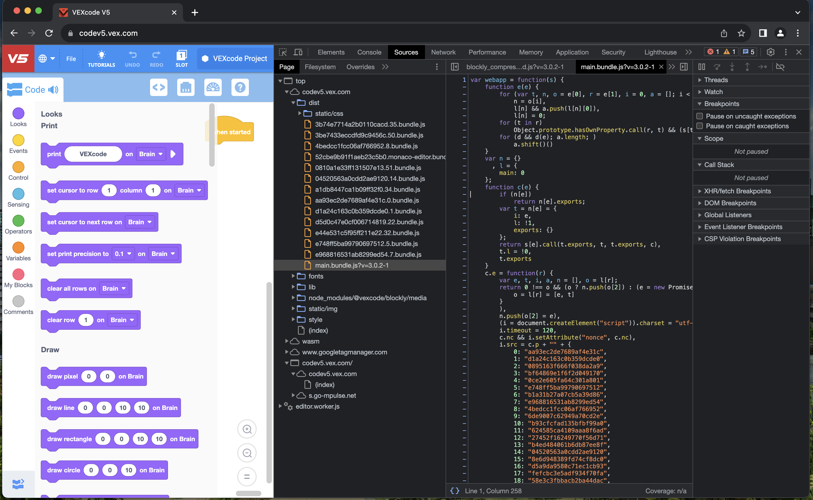
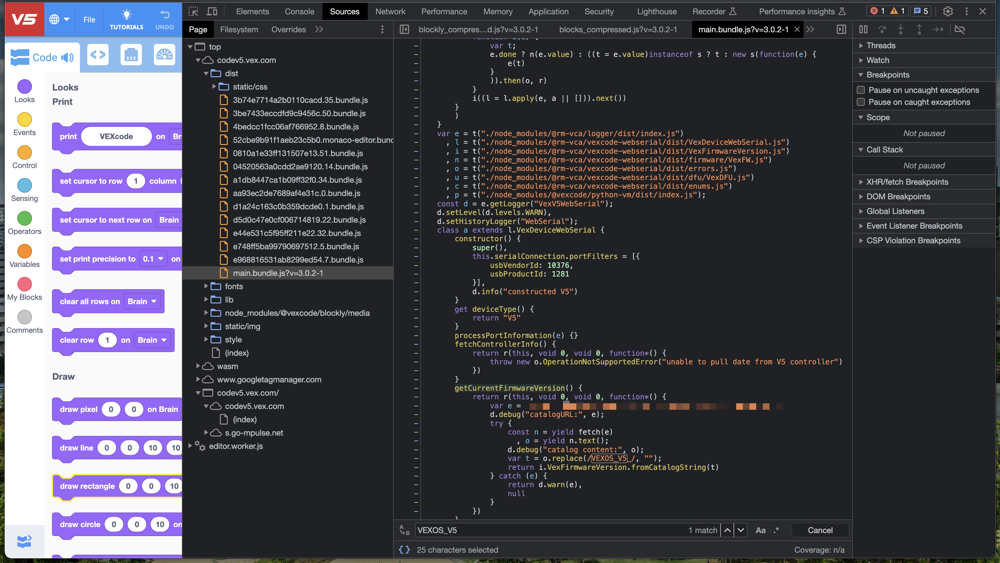
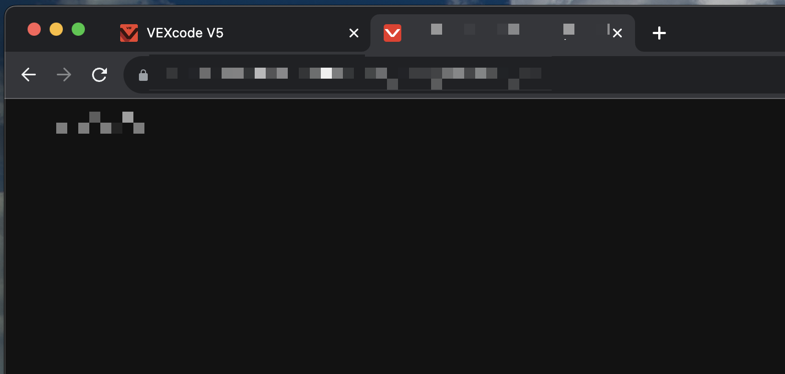

# Getting the latest version firmware image from VEX
Again, another complicated process. First, you'll want to visit the [VEXcode V5](https://codev5.vex.com/) site. Next, open up DevTools, go to Sources, and find the file that starts with `main.bundle.js?v=`. 


Within this file, you'll find all sorts of gems (such as how to communicate with the V5 Brain over serial, etc). You'll want to Ctrl+F for `VEXOS_V5`, which'll take you to a function called `getCurrentFirmwareVersion()`. This is similar to the SDK, where you first get the `catalog.txt` file to get the most recent version, then download it with a certain prefix.



Visit the URL, and you'll be greeted with the current version number (similar to the SDK). 



Use this version number, and replace the URL containing catalog.txt with it, like so:
```
https://${URL_WITH_NO_CATALOG.TXT}/${VERSION_NUMBER}.vexos
```

Visit this site, and your browser will download a file ending in a `.vexos` extension. This is just another `.zip` file renamed, so 
use your favorite ZIP tools to extract it's contents.

Congratulations! You just grabbed the most recent firmware version for the VEX V5 Brain.