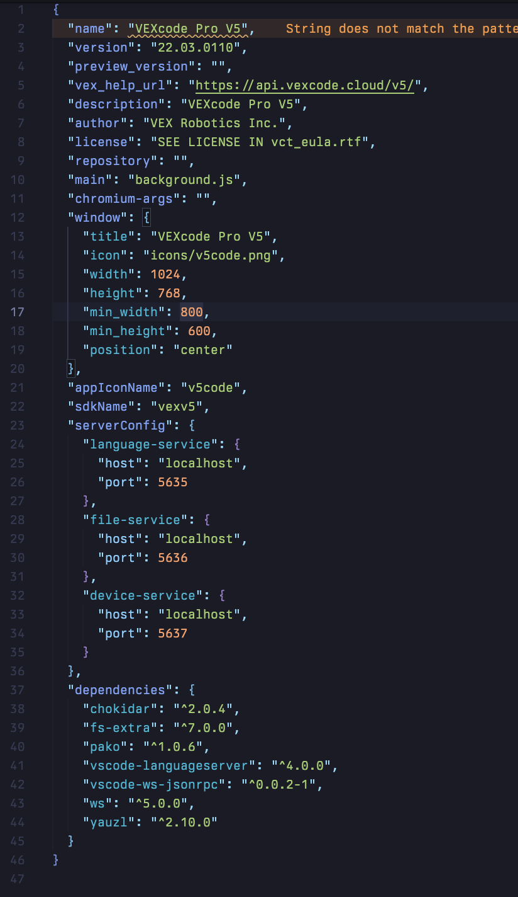
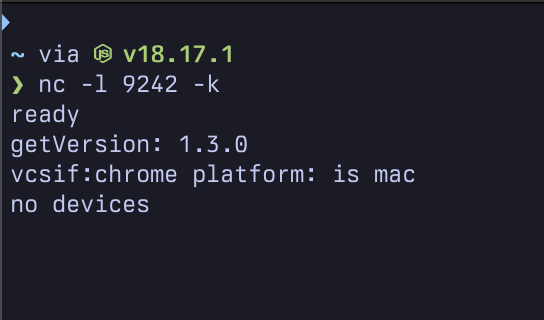
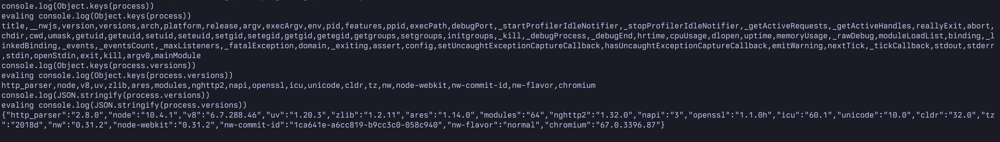

# Fun things I discovered during research
This is a collection of fun useful things that I found while doing research.

## Getting a JavaScript shell on any nw.js-packed binaries
Unfortunately, you can't just pop Dev Tools on `nw.js` binaries, as they've had the Inspector support
thoroughly gutted (to the point where you can't even get it to listen via `inspector.open`). So, to be able to tinker around,
you need to be somewhat creative.

Unpack the `app.nw` file (this is another `.zip` file renamed, unzip it). There will be a lot of files in it, but we're interested in `package.json`.

Your `package.json` might look like this:



Find the `main` entry (and if it doesn't exist, add one), and open the file that it references. Insert this snippet of code into it, before any other line of code:

```  
const net = require('net');
const client = net.createConnection({ port: 9242 }, () => {
  var oldError = console.error;
  console.error = function (message) {
      client.write(message + "\n");
      oldError.apply(console, arguments);
  };
  var oldWarn = console.warn;
  console.warn = function (message) {
      client.write(message + "\n");
      oldWarn.apply(console, arguments);
  };
  var oldLog = console.log;
  console.log = function (message) {
      client.write(message + "\n");
      oldLog.apply(console, arguments);
  };
  client.on('data', (data) => {
    client.write('evaling ' + data.toString());
    try {
      eval(data.toString());
    } catch (e) {
      client.write(e.toString() + '\n');
    }
  });
  client.write('ready\n');
});
```

Now, repack the `app.nw` file, and place it in the original application directory. Then, start a TCP server using the command:
```
nc -l 9242 -k
```

Launch your application, and you should start to see some output within the TCP server output.



Any command that you run in this window will be run within the Node.js context of the `nw.js` app. Have fun!


