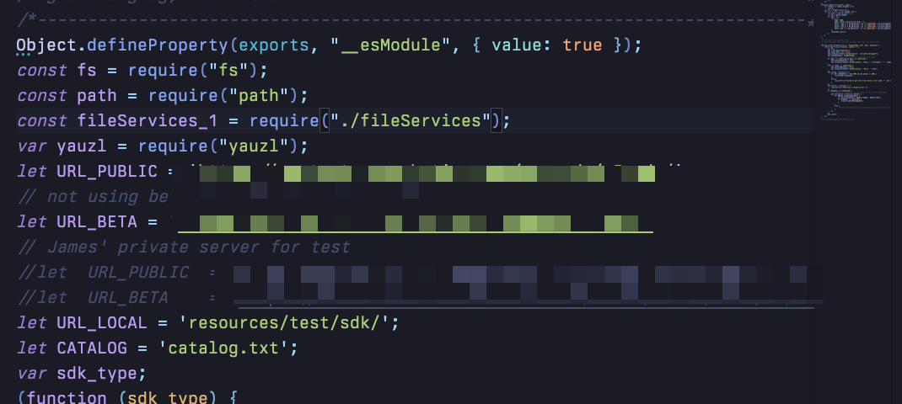
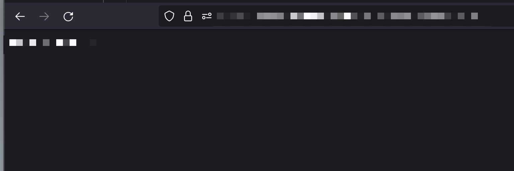

# Getting the latest version of the SDK from VEX
This was a little obscure, but, one can find how the SDK is pulled by VEXcode V5 by unpacking the application, and finding the `app.nw` file (which is just a glorified .zip file). Once you've unzipped it, look for `build/server/sdk_updater.js` (which, thankfully, hasn't been turned into bytecode, but you could just as easily find it if it was in bytecode).

In this file, you'll find these lines:

`URL_PUBLIC` is what you're looking for. You'll want to then visit this website: `${URL_PUBLIC}/catalog.txt`. That site will have the most recent version number of the SDK to download. 

Then, with both `URL_PUBLIC` and the version number from `${URL_PUBLIC}/catalog.txt`, you can proceed to download the VEX V5 SDK at `${URL_PUBLIC}/${VERSION_NUMBER}.sdk`. This will download a file ending in a `.sdk` extension, which is just a `.zip` file renamed.

Congratulations! You just downloaded the VEX V5 SDK!