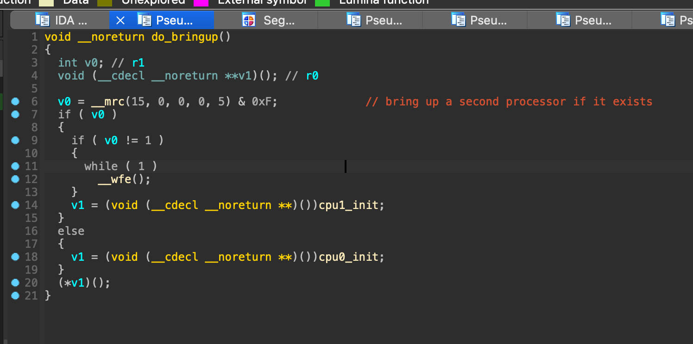

# VEX V5
## Main CPU
* CPU: Xilinx Zynq XC7Z010-3CLG400E (Xilinx Zynq 7000-series)
* Dual-core 32-bit ARM Cortex-A9 r3p0 (ARMv7-A with NEON)
  * VEXos is proported to run on CPU #0, and user code runs on CPU #1
* 64 KB of L1 cache
* 512 KB of L2 cache
* Supports 2x GbE, 2x USB 2.0 HS, UART, I2C, etc
  * Can support even more with built-in FPGA
## Aux CPU
* Claimed 2x Cortex M0, unconfirmed
  * Could be implemented as soft cores within FPGA, to be confirmed 
  * Looks to be primarily dedicated for the shit-load of IO on the device 
## RAM
* Appears to be 2x 512MB DDR2 SDRAM (MT47H32M16NF-25E), unconfirmed
* MFG claims 128MB of RAM (???)
## Flash
* Appears to be 256MB SPI flash (MT25QL256ABA8ESF-0SIT), unconfirmed
* MFG claims 32MB flash (???)
## FPGA
Artix-7 FPGA equivalent
  * 28K programmable cells, 17.6K LUTs
* No PCIe uplink (XC7Z015+ only)
* FPGA bitstream is shipped with device firmware
## Communication
Bluetooth 4.2, VEXnet 3.0 (???)
## Display
4.25" 480 x 272 TFT touch screen (claimed 60Hz refresh rate, maybe a CH430WQ12A-T?)
* Looks off-the-shelf, not custom to this device
* Powered by [logiCVC IP core](https://www.xilinx.com/products/intellectual-property/1-8dyf-854.html) on the FPGA
## Firmware
* Looks to be an entirely custom bare-bones OS, built on top of logicBRICKS IP / HAL
* Firmware is shipped as two pieces: assets.bin, BOOT.bin
* BOOT.bin is a Xilinx Zynq boot image, for which an ImHex pattern file is provided (for your enjoyment)
* assets.bin is still TBD on the layout of such
* BOOT.bin contains:
  * FSBL.elf (first-stage bootloader)
  * design_1_wrapper.bit (bitstream for FPGA)
  * MainLoop.elf (unclear - appears to be empty)
  * system_0.elf (shared userspace RTOS for CPU0 / CPU1)
* system_0.elf (aka: VEXos)
  * Contains 3 sections
    * Section 0 (or, what I've come to call .data) is executable code mapped at 0x03400000 - 0x0349C014
    * Section 1 (unclear what this contains) is mapped at 0x037C000 - 0x037FD040
    * Section 2 (user code segment stub) is mapped at 0x03800000 - 0x03800050
* system_0.elf is shared between CPU0 / CPU1
  * On startup, a register is checked to see what CPU we're currently executing on:

    

    `__mrc(15, 0, 0, 0, 5) & 0xF` checks the `CPUID` bits in the [Multiprocessor Affinity Register](https://developer.arm.com/documentation/ddi0464/d/System-Control/Register-descriptions/Multiprocessor-Affinity-Register?lang=en) to see what processor we're currently running on
    
    If we're CPU0, hold the processor in an idle state for now. If we're CPU1, then proceed to initialize & set everything up.
  * Not sure if CPU0 is brought out of this idle state at some other point
    * It probably is, just need to find where
    * This is typically done using the [Power State Coordination Interface](https://developer.arm.com/Architectures/Power%20State%20Coordination%20Interface) - 
  * CPU1 actually does most of the initialization work for some Reason

## Further reading:
* [zynq-mkbootimage](https://github.com/antmicro/zynq-mkbootimage)
  * This needs some modifications in order to support the 3 sections contained within the ELF binary for
    system_0.elf. I have done those changes, but the code is too hacky to share publicly :frown:. Left as a 
    challenge to the reader :-)
* [Xilinx Zynq 7000 Datasheet](https://docs.xilinx.com/v/u/en-US/ds190-Zynq-7000-Overview)
* [Xilinx Zynq 7000 SoC Technical Reference Manual](https://docs.xilinx.com/r/en-US/ug585-zynq-7000-SoC-TRM)
* [Xilinx Zynq 7000 SoC Software Developers Guide](https://docs.xilinx.com/v/u/en-US/ug821-zynq-7000-swdev)
* [Xilinx Zynq 7000 SoC Boot and Configuration](https://docs.xilinx.com/r/en-US/ug1400-vitis-embedded/Zynq-7000-SoC-Boot-and-Configuration)
* [Cortex A9 MPCore Technical Reference Manual r3p0](https://developer.arm.com/documentation/ddi0407/g/?lang=en)
* [logiCVC-ML Compact Multilayer Video Controller](https://www.logicbricks.com/Products/logiCVC-ML.aspx)

